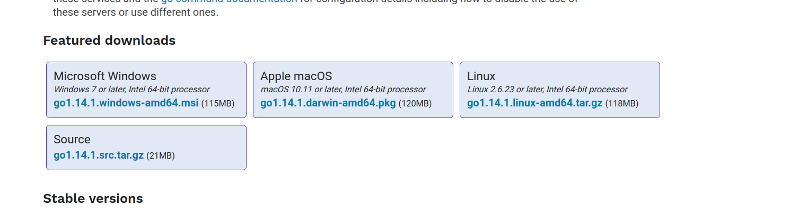
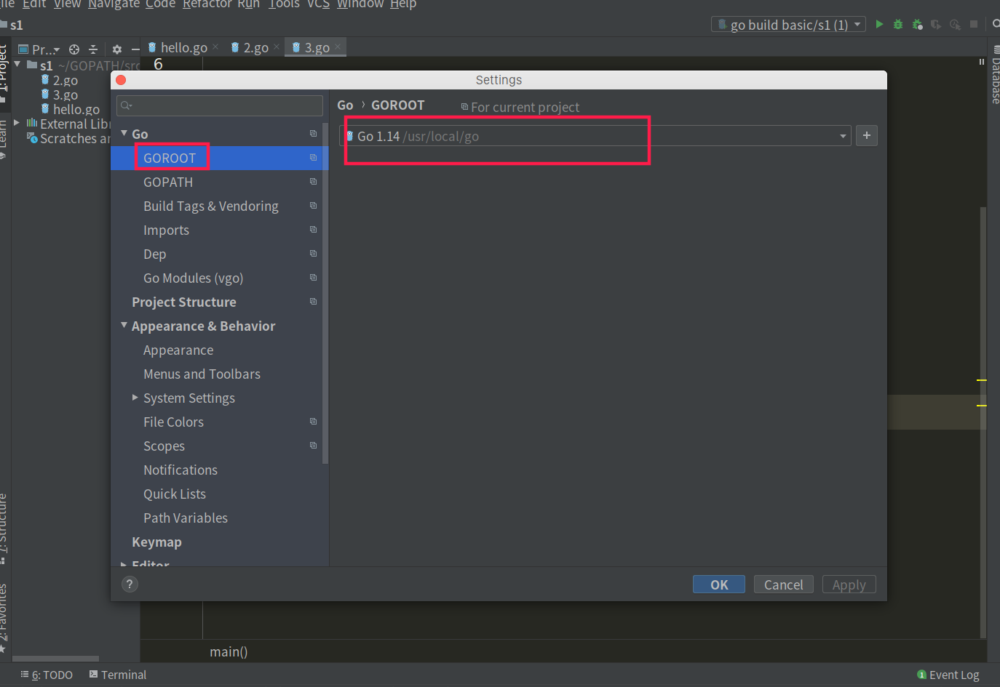
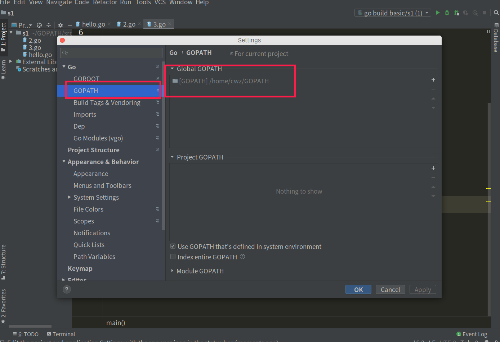
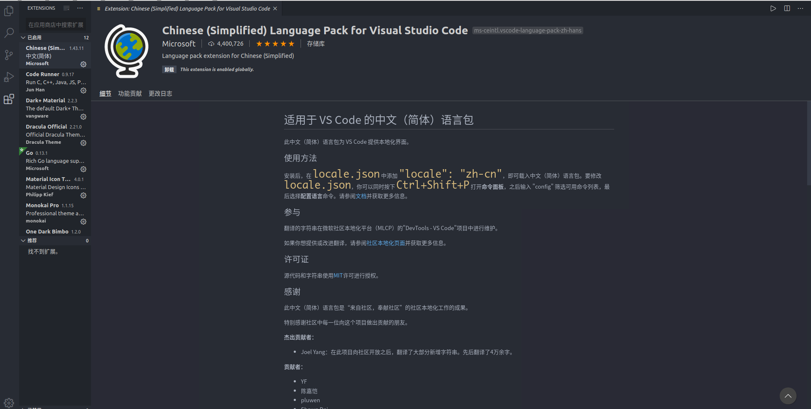
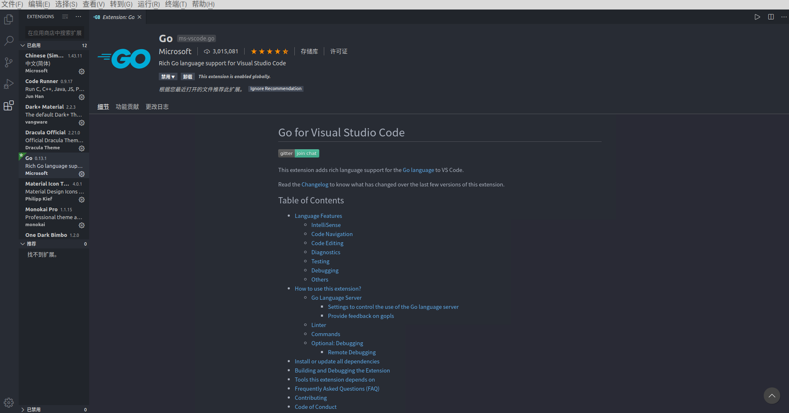
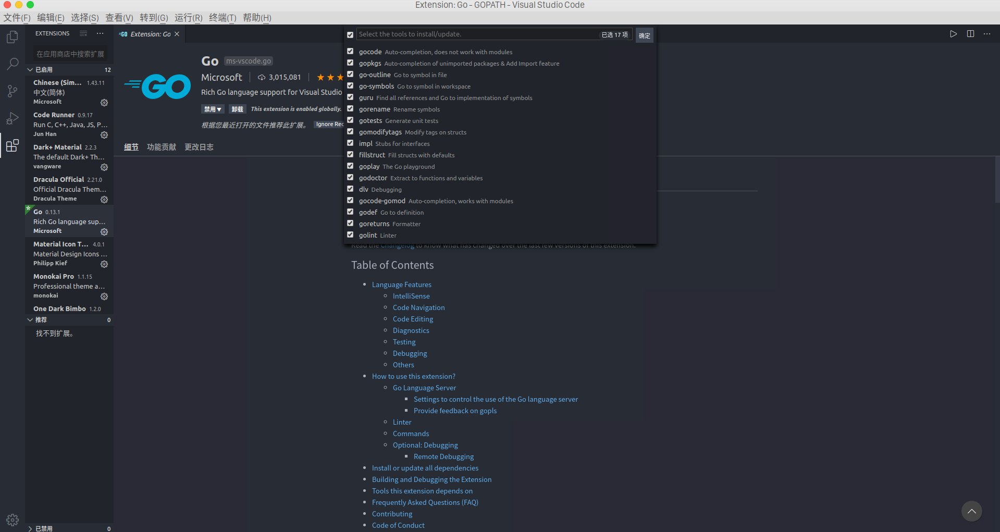

# golang简介

## go语言介绍

- Go 即Golang，是Google公司2009年11月正式对外公开的一门编程语言。
- Go是一门静态强类型语言，是区别于解释型语言的编译型语言。

## go语言特性

- 是一门跨平台的编译型语言，可以在不通平台可以编译出另一个平台的可执行文件，如在Windows平台可以编译linux平台的可执行程序
- 有垃圾回收机制
- 支持面向对象和面向过程的编程模式

## 编译型语言和解释型语言

### 1、编译型语言

需通过编译器（compiler）将源代码编译成机器码，之后才能执行的语言。一般需经过编译（compile）、链接（linker）这两个步骤。编译是把源代码编译成机器码，链接是把各个模块的机器码和依赖库串连起来生成可执行文件。

- 优点：编译器一般会有预编译的过程对代码进行优化。因为编译只做一次，运行时不需要编译，所以编译型语言的程序执行效率高。可以脱离语言环境独立运行。
- 缺点：编译之后如果需要修改就需要整个模块重新编译。编译的时候根据对应的运行环境生成机器码，不同的操作系统之间移植就会有问题，需要根据运行的操作系统环境编译不同的可执行文件。

代表语言：C、C++、Golang

### 2、解释型语言

解释性语言的程序不需要编译，相比编译型语言省了道工序，解释性语言在运行程序的时候才逐行翻译。

- 优点：有良好的平台兼容性，在任何环境中都可以运行，前提是安装了解释器（虚拟机）。灵活，修改代码的时候直接修改就可以，可以快速部署，不用停机维护。
- 缺点：每次运行的时候都要解释一遍，执行速度不如编译型语言。

代表语言：JavaScript、Python、PHP、Perl、Ruby


## 动态语言和静态语言

### 1、动态语言

是一类在运行时可以改变其结构的语言：例如新的函数、对象、甚至代码可以被引进，已有的函数可以被删除或是其他结构上的变化。通俗点说就是在运行时代码可以根据某些条件改变自身结构。

主要动态语言：Object-C、C#、JavaScript、PHP、Python

### 2、静态语言

与动态语言相对应的，运行时结构不可变的语言就是静态语言。如Java、C、C++

## 动态类型语言和静态类型语言

### 1、动态类型语言

动态类型语言和动态语言是完全不同的两个概念。动态类型语言是指在运行期间才去做数据类型检查的语言，说的是数据类型，动态语言说的是运行是改变结构，说的是代码结构。

**动态类型语言的数据类型不是在编译阶段决定的，而是把类型绑定延后到了运行阶段。**

主要语言：Python、Ruby、JavaScript、swift、PHP、Perl。

### 2、静态类型语言

静态语言的数据类型是在编译其间确定的或者说运行之前确定的，编写代码的时候要明确确定变量的数据类型。

主要语言：C、C++、C#、Java、Golang

## 强类型语言和若类型语言

### 1、强类型语言

强类型语言，一旦一个变量被指定了某个数据类型，如果不经过强制类型转换，那么它就永远是这个数据类型。你不能把一个整形变量当成一个字符串来处理。

主要语言：Java、Python、Ruby

### 2、弱类型语言

数据类型可以被忽略，一个变量可以赋不同数据类型的值。一旦给一个整型变量a赋一个字符串值，那么a就变成字符类型。

主要语言：JavaScript、PHP

**注意：一个语言是不是强类型语言和是不是动态类型语言也没有必然联系。**Python是动态类型语言，是强类型语言。JavaScript是动态类型语言，是弱类型语言。Golang是静态类型语言，是强类型语言。


## Go开发环境搭建

**注意：**Go语言1.14版本之后推荐使用go modules管理以来，也不再需要把代码写在GOPATH目录下了

## 下载地址

Go官网下载地址：<https://golang.org/dl/>

Go官方镜像站（推荐）：<https://golang.google.cn/dl/>

## 不同平台安装

Windows平台和Mac平台推荐下载可执行文件版，Linux平台下载压缩文件版



### Windows安装

双击，一路next即可

### linux下安装

我们在版本选择页面选择并下载好`go1.14.1.linux-amd64.tar.gz`文件：

```bash
wget https://dl.google.com/go/go1.14.1.linux-amd64.tar.gz
```

解压到指定目录

```bash
mkdir -p /usr/local/go  # 创建目录
tar -C /usr/local/go zxvf go1.14.1.linux-amd64.tar.gz # 解压
```

配置环境变量

Linux下有两个文件可以配置环境变量，其中`/etc/profile`是对所有用户生效的；`$HOME/.profile`是对当前用户生效的，根据自己的情况自行选择一个文件打开，添加如下两行代码，保存退出。

```bash
export GOROOT=/usr/local/go
export PATH=$PATH:$GOROOT/bin
```

修改`/etc/profile`后要重启生效，修改`$HOME/.profile`后使用source命令加载`$HOME/.profile`文件即可生效。

```go
❯ go version
go version go1.14 linux/amd64
```


### mac下安装

下载可执行文件安装即可

## Go语言架构

GOPATH的工作区包含bin，src，和pkg这三个：

- src——源码（包含第三方的和自己项目的）
- bin——编译生成的可执行程序
- pkg——编译时生成的对象文件

## Go开发编辑器

Go采用的是UTF-8编码的文本文件存放源代码，理论上使用任何一款文本编辑器都可以做Go语言开发。

使用jetbrains出品的付费IDE Goland 以及 微软的 vscode

### Goland 使用简单，推荐使用。简单配置如下：





### vscode配置

安装简体中文插件



安装go插件




安装Go语言开发工具包

在Go语言开发的时候为我们提供诸如代码提示、代码自动补全等功能。

Windows平台按下`Ctrl+Shift+P`，Mac平台按`Command+Shift+P`，这个时候VS Code界面会弹出一个输入框，如下图：



选中全部，点击确定，安装。当然很可能会下载失败

一般我是直接下载已经编译好的可执行文件，拷贝到`GOROOT/bin` 目录下

[go-tools百度云下载链接, 密码：7ols](https://pan.baidu.com/s/1Fh7J6m1zrKGShAP3uh-XqQ)


## 用Go编写第一个程序

### 第一个helloword

```go
package main      // 必须指明哪个包 main包

import "fmt"     // 表示导入fmt包

func main() {      // 定义了一个main函数
	fmt.Println("hello world")
}

// 写go 代码，必须把代码放在  main包下的main函数中（go程序的入口，是main包下的main函数）
// 在go语言中，包导入必须使用，否则报错，注释掉，包自动删除(这是goland这个IDE做的)
```

### go中的注释

```go
//go当中的注释（跟js一样，java）
// goland快捷键：ctrl+/  快速单行注释，解开注释
//单行注释
/*
多行注释
多行注释
 */
```

### go代码的执行

- 可以利用goland这个IDE的快捷键
- 先编译再执行

```bash
# 在linux下
go build hello.go   #  编译，编译成当前平台的可执行文件
./hello     # 执行
```

- 编译并执行

```bash
go run hello.go     # 不产生可执行文件
```


### go install

`go install`表示安装的意思，它先编译源代码得到可执行文件，然后将可执行文件移动到`GOPATH`的bin目录下。因为我们的环境变量中配置了`GOPATH`下的bin目录，所以我们就可以在任意地方直接执行可执行文件了。

## 跨平台编译

默认我们`go build`的可执行文件都是当前操作系统可执行的文件，如果我想在windows下编译一个linux下可执行文件，那需要怎么做？

需要指定目标操作系统的平台和处理器架构即可：

```bash
SET CGO_ENABLED=0  # 禁用CGO
SET GOOS=linux  # 目标平台是linux
SET GOARCH=amd64  # 目标处理器架构是amd64
```

*使用了cgo的代码是不支持跨平台编译的*

然后再执行`go build`命令，得到的就是能够在Linux平台运行的可执行文件了。

Mac 下编译 Linux 和 Windows平台 64位 可执行程序：

```bash
CGO_ENABLED=0 GOOS=linux GOARCH=amd64 go build
CGO_ENABLED=0 GOOS=windows GOARCH=amd64 go build
```

Linux 下编译 Mac 和 Windows 平台64位可执行程序：

```bash
CGO_ENABLED=0 GOOS=darwin GOARCH=amd64 go build
CGO_ENABLED=0 GOOS=windows GOARCH=amd64 go build
```

Windows下编译Mac平台64位可执行程序：

```bash
SET CGO_ENABLED=0
SET GOOS=darwin
SET GOARCH=amd64
go build
```