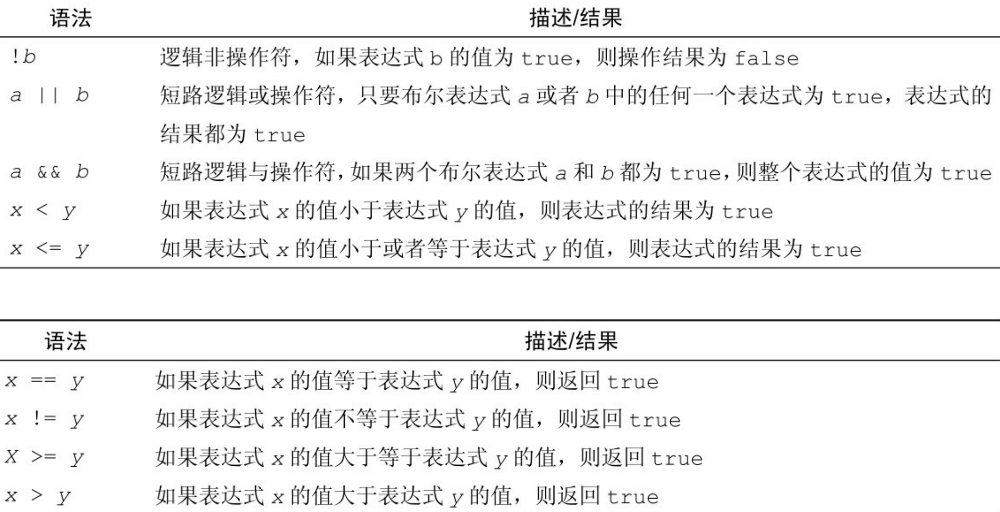

# go基础类型

go的关键字：


## go的变量

三种书写方式

### 1、全定义

```go
func main() {
	// var关键字 变量名 变量类型 = 变量值
	var a int =10
	fmt.Println(a)
}
```

### 2、类型推导（自动推导出变量类型）

```go
func main() {
	var a =10
	fmt.Println(a)
	fmt.Printf("%T",a)   //查看a的类型
}
```

### 3、简略声明

```go
func main() {
	a := 10      //冒号跟等号是一起的
	fmt.Println(a)
}
```


注意

### 4、只定义变量，不赋值

```go
func main() {
	//var a int    //int类型空值，是0
	//var a
	//a :=
	//a=100
	////a="100"      //把字符串100赋值给a，不支持，静态语言
	//fmt.Println(a)
}
```

### 5、声明多个变量,三种方式都可以

```go
func main() {
	//var a,b,c int=10,11,12
	//var a,b,c=10,11,12
	//var a,b,c=10,11,"xxx"
	a,b,c:=11,12,"ddddf"
	fmt.Println(a)
	fmt.Println(b)
	fmt.Println(c)
	fmt.Printf("%T",c)
}
```

### 6、变量不能重复定义

```go
func main() {
	//var a int
	////var a=90   //重复定义
	//a :=90      //重复定义
	//a=90
	//特殊情况
	//var a int
	//var a,b=10,20  // 不允许
	////a,b:=10,30   //我觉得a是重复定义,go语法允许
	fmt.Println(a)
	fmt.Println(b)
}
```

总结

- 变量定义了必须使用，否则报错（只有go要求这样）
- 变量要先定义再使用
- 变量类型是固定的，不允许中途改变（静态语言）
-  如果只是定义变量，必须指定类型,只能用第一种定义方式
- 变量不允许重复定义
- 以后所有类型的变量定义，就参照变量定义的三种方式

## go的常量

常量：恒定不变的量,只赋值一次，以后再也不能改了

```go
package main

import "fmt"


//const关键字 变量名 变量类型 =值

//const name  string=  "cwz"
//类型推导
//const name  =  "cwz"

//简略声明 不可以

// 可以同时定义多个常量
const name,age  ="cwz",19 
func main() {
	//name="reese"  //不允许修改
	fmt.Println(name)
}
```


## 变量类型

### 数值类型

#### 整数类型

整数类型可以说是我们最常用的一种类型，如果你用 python 的话非常省心，但是 go 里边却有非常多的 int 类型。 对于一门追求性能的语言来说，有些地方可以省内存就省一点。这里需要注意的就是每种类型取值范围，确保不要超范围了。业务中经常使用也就是 int64/int32 了。


```go
package main

import "fmt"

func main() {
	//1 int uint
	var a int8=100000
	var a int64=100000
	var a uint=-8  //错误
	var a uint=8
	fmt.Println(a)
}
```


#### 浮点数类型


```go
package main

import "fmt"

func main() {
	//float：小数
	var b int =2.345  // 报错
	fmt.Println(b)
	var a float32=2.345
	fmt.Println(a)
}
```


### 字符串


```go
package main

import "fmt"

func main() {
	var name string = "my name is cwz"
	b := "reese"       // go中没有三引号
	c := `my name is ` + b   // 可以用反引号

	fmt.Println(name)
	fmt.Println(b)
	fmt.Println(c)
}
```

### 布尔类型



```go
package main

import "fmt"

func main() {
	//布尔类型
	//var a bool=true
	//var a =false
	a:=false

	//a=0  //类型不匹配
	fmt.Println(a)
}
```

