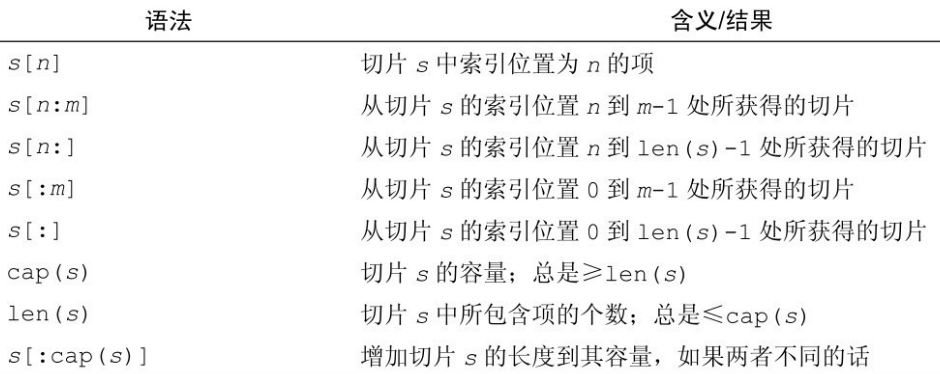

# Go的数组和切片

- 数组是常用的线性结构，在Go中提供了两种线性结构：数组和切片。数组是同一类型元素的集合，类似于python中的列表（列表中可以放任意元素）。要注意的是在Go中**数组是固定长度的某种类型的序列**
- 而切片更加灵活，切片的长度是可以变化的


## 数组

数组是一个包含相同类型的固定长度的序列，不像如python这样的动态语言可以在列表中存储不同类型的元素。数组的声明(数组有大小，放的数据类型),定义阶段长度固定了，以后不能改。

```
声明: [length]Type
初始化：[N]Type{value1, value2,..., valueN}
省略长度：[...]Type{value1, value2,..., valueN}
二维数组: [N][M]Type
```


```go
package main

import "fmt"

func main() {
    // 声明一个 int数组，并初始化
	var a [3]int = [3]int{1, 2, 3}
	fmt.Println(a)
}
```


```go
// 不是可变长的
a :=[...]int{28:1,23:999}  //长度定下了29
a :=[...]int{2,3,4}  //长度定下了3
a :=[3]int{2,3,4}  //长度定下了3

fmt.Println(a[2])    // 不能超长
```

数组是值类型（值类型,引用类型），当做函数传参，传到函数内部，修改数组，不会影响原来的，go中函数传参，都是copy传递。

## 值类型和引用类型

### 常见的值类型和引用类型

#### 值类型

基本数据类型int系列,float系列,bool,string,数组和结构体struct

#### 引用类型

指针,切片slice,map,管道chan,interface等都是引用类型

### 使用特点

#### 值类型

变量直接存储值,内存==通常==在栈中分配

#### 引用类型

变量存储的是一个地址,这个地址对应的空间才是真正存储数据值,内存==通常==在堆上分配,当没有任何变量引用这个地址时,该地址对应的数据空间就成为一个垃圾,由GC来回收.

golang中存在逃逸分析,所以上述为通常情况,也会出现值类型跑到堆中或者引用类型跑到栈中的情况.


## 数组补充

循环数组，使用**for循环**和**range**迭代数组

```go
package main

import "fmt"

func main() {
	var a = [3]int{1, 3, 5}
	for i := 0; i < len(a); i++ {
		fmt.Println(a[i])
	}
}
// 循环打印出1,3,5
```

使用range：

```go
package main

import "fmt"

func main() {
	var a = [3]int{1, 3, 5}
	for i, v := range a {
		fmt.Println(i,v)   // i是索引，v是值
	}
}

/*
0 1
1 3
2 5
*/
```


定义多维数组

```go
package main

import "fmt"

func main() {
	var a [3][3]int = [3][3]int{
		{1, 2, 3},
		{2, 3, 4},
		{3, 4, 5},
	}
	fmt.Println(a)  // [[1 2 3] [2 3 4] [3 4 5]]
	a[0][1] = 222
	fmt.Println(a)  // [[1 222 3] [2 3 4] [3 4 5]]
}
```


## 切片

- 切片比数组更加灵活，长度是可以变化的。
- 切片是由数组建立的一种方便、灵活且功能强大的包装。
- 切片本身不拥有任何数据。它们只是对现有数组的引用。
- 可以简单地理解为切片是一个指向数组的指针，这个数组有它的总容量，和目前使用的长度。

### 先创建一个数组，在创建一个切片

```go
package main

import "fmt"

func main() {
	// 先创建数组
	var a [5]int = [5]int{1, 2, 3, 4, 5}
	// 创建切片
	//var b = a[:]   // 切所有
	var b = a[2:]   // 第三个位置切到最后，前闭后开
	fmt.Println(b)
    
    //中括号有东西，就是数组，没有东西就是切片
	var c[]int = a[1:3]
	fmt.Println(c)
    
}
```


### 修改切片

切片修改的时候会影响原来的数组，数组的修改也会影响切片

```go
package main

import "fmt"

func main() {
	var a [5]int = [5]int{1, 2, 3, 4, 5}
	var b []int = a[1:4]
	// 切片修改 会影响数组
	b[0] = 666
	fmt.Println(b) // [666 3 4]
	fmt.Println(a) // [1 666 3 4 5]
	// 数组修改 也会影响切片
	a[3] = 777
	fmt.Println(a)   // [1 666 3 777 5]
	fmt.Println(b)   // [666 3 777]

}
```


使用append修改切片：

```go
package main

import "fmt"

func main() {
	a :=[]int{1,2,3,4,5}
	fmt.Println(len(a))  // 5
	fmt.Println(cap(a))   // 5
	a = append(a, 666)
	fmt.Println(len(a))  // 6
	fmt.Println(cap(a))  // 10

}
```

使用append追加元素，新的元素添加到切片会创建一个数组。现有数组的元素被复制到这个新数组中，并返回新数组的新切片引用，新切片的容量是旧切片的两倍。


### 切片的长度和容量

```go
package main

import "fmt"

func main() {
	//len() :长度，现在有多少值
	//cap() :容量,总共能放多少值
	var a [10]int = [10]int{1, 2, 3, 4, 5, 6, 7, 8, 9, 10}
	var b []int = a[2:6]
	fmt.Println(len(b)) // 4
	fmt.Println(cap(b))  // 8
}
```

以下是 slice 的常见操作，很多和数组比较类似：



### 使用make创建一个切片

切片空值是  **nil类型**（引用类型空值都是nil）

```go
package main

import "fmt"

func main() {
	var a []int
	fmt.Println(a)
	if a==nil{
		fmt.Println("我是空的")
	}
}
```

**make([]Type, length)**， 最常用的一种方式, 如果实现知道 slice 的长度，可以避免 slice 扩容操作，性能更好。

make内置函数。第一个参数写类型，第二个参数是切片的长度，第三个参数是切片的容量，如果切片容量参数不写，默认切片容量和切片的长度相同

```go
package main

import "fmt"

func main() {
	var a []int = make([]int, 3, 5) // 长度是多少3，容量是5，容量如果不传，默认跟长度一样
	a[0] = 666
	fmt.Println(a)   // [666 0 0]
	fmt.Println(len(a))  // 3
	fmt.Println(cap(a))  // 5
}
```

### 多维切片

类似于数组，切片可以有多个维度

```go
package main

import ("fmt")

func main() {
	pls := [][]string{
		{"C", "C++"},
		{"JavaScript", "Java"},
		{"Go", "Rust"},
	}
	for _, v1 := range pls {
		for _, v2 := range v1 {
			fmt.Printf("%s ", v2)
		}
		fmt.Printf("\n")
	}
}

/*
输出：
C C++ 
JavaScript Java 
Go Rust
*/
```

### 切片之copy

```go
package main

import "fmt"

func main() {
	var a []int = make([]int, 6, 7)
	var b []int = []int{1, 2, 3, 4, 5}
	fmt.Println(a)
	fmt.Println(b)
	// 把b的数据copy到a上
	copy(a, b)
	fmt.Println(a)    // [1 2 3 4 5 0]
	fmt.Println(b)
}
```

### 循环切片

```go
package main

import "fmt"

func main() {
	names := []string{"zhang", "wang", "li", "zhao"}
	for idx, name := range names { // 如果没有用到下标 idx，可以写成下划线 _ 作为占位符，但是不能省略
		fmt.Println(idx, name)
	}
}
```

