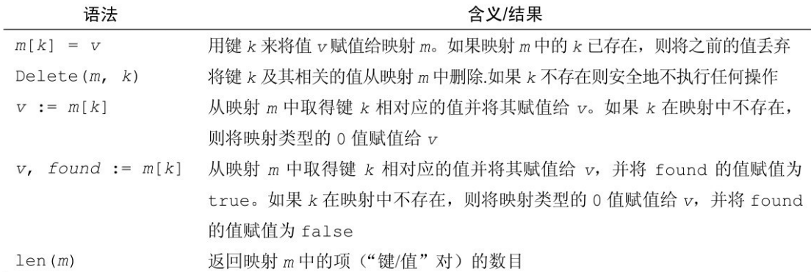

# Go的映射map

## 映射map

很多编程语言都有键值对（key-value）类型的数据结构，如python的dict（）字典、c++的map。Go语言也内置的map数据结构。一般底层使用哈希表或者红黑树来实现map，查询效率是非常高的。

Go的map数据结构，常见的基础类型如int、float64、string等都可以作为map的key的，而value是没有要求的。

以下是使用map 的几种方式：

```go
// 创建一个空的 map
make(map[KeyType]ValueType)
// 创建一个空的 map
map[KeyType]ValueType{} // 等价于 make(map[KeyType]ValueType)


// 创建一个容纳 capacity 个键值对的 map，键的类型是 KeyType，值的类型是 ValueType
make(map[KeyType]ValueType, capacity)


// 创建并且初始化一个 map
map[KeyType]ValueType{key1: value1, key2: value2,..., keyN: valueN}
```


```go
package main

import "fmt"

func main() {
	var a map[int]string
	fmt.Println(a)
	if a == nil {
		fmt.Println("空")    // map的空值是nil
	}
}
```

初始化map

```go
package main

import "fmt"

func main() {
	a := map[int]string{1: "cwz", 2: "reese"}
	fmt.Println(a)
}
```

map的操作语法，如下：



```go
package main

import "fmt"

func main() {
	a := map[int]string{1: "cwz", 2: "reese"}
	a[3] = "neo" // 添加元素
	a[1] = "qwe"  // 更新
	fmt.Println(a)   // map[1:qwe 2:reese 3:neo]
    
    fmt.Println(a[5])  // 取不到，会打印出value值的默认值（空值）

}
```

注意：

- 这里需要注意的就是使用 `v := m[k]` 这种方式获取值，如果相应的 k 不存在，map 不会像 python中的字典 一样抛错，而是直接给 你返回一个类型的零值(数字是0，字符串是空串)
- 一般我们用 `v, ok := m[k]` 这种语法，如果不存 在 k 的话，ok 的值是 false，这样就知道究竟是否存在这个 k 了。

### map是引用类型

和切片类似，map也是引用类型。当map被赋值为一个新变量的时候，它们指向同一个内部数据结构。因此，改变其中一个变量，就会影响另一个变量。

### map的相等性

map之间不能使用`==` 来判断，判断两个map是否相等的方法是遍历比较两个map中的每个元素。


## 将go中的map按key进行排序

```go
package main

import (
	"fmt"
	"sort"
)

func main() {
	fruits := map[string]int{
		"oranges": 100,
		"apples":  200,
		"banans":  300,
	}
	// 将key转移到切片，将切片进行排序
	var a [] string
	for key := range fruits {
		a = append(a, key)
	}
	sort.Strings(a)
	for _, key := range a {
		fmt.Printf("%s:%v\n", key, fruits[key])
	}
}
```

