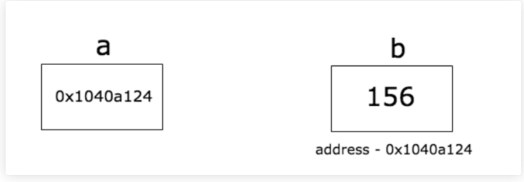

# Go的指针

## 什么是指针

指针是一种存储变量内存地址的变量。



如上图所示，变量b的值为156，而b的内存地址为`0x1040a124`，变量a存储了b的地址，就称a指向了b。

在Go中的指针比C/C++语言中的指针更加容易学习。

Go 语言的取地址符是 &，放到一个变量前使用就会返回相应变量的内存地址。

演示实例：

```go
package main

import "fmt"

func main() {
	b :=1234
	var a *int = &b
    // var c *string =&b   //int类型指针是不能赋值给字符串类型的指针
	fmt.Println("b的地址是", a)
	fmt.Printf("a的类型是%T", a)
}
/*
b的地址是 0xc000126010
a的类型是*int
*/
```

`&`操作符用于获取变量的地址。如果在类型前面加*，表示指向这个类型的指针

## 指针的零值

指针的零只是`nil`

```go
package main

import "fmt"

func main() {
	var b *int
	fmt.Println(b)
}
// <nil>
```

## 指针的解作用

在指针变量前加*，表示解引用（反解），通过地址拿到值

```go
package main

import "fmt"

func main() {
	var b = 125
	a := &b
	fmt.Println(a)  // 0xc00001e0c8
	fmt.Println(*a) // 125，通过*拿到指针a执行的值
}
```


## 向函数传递指针参数

```go
package main

import "fmt"

func main() {
	b := 125
	fmt.Println(b)   // 125
	test(&b)
	fmt.Println(b)   // 110
}

func test(x *int) {
	*x = 110
}
```

因为指针是引用类型，如上面代码的函数test传递了指针变量b，在test函数内使用了解引用，修改了b的值。

注意：**不要向函数传递数组的指针，而应该使用切片**

如果我们想要在函数内修改一个数组，并希望调用函数的地方也能得到修改后的数组，可以将一个指向数组的指针传递给这个函数。

传递数组的指针：

```go
package main

import "fmt"

func main() {
	var a [3]int = [3]int{1, 2, 3}
	fmt.Println(a)  // [1 2 3]
	test(&a)
	fmt.Println(a)   // [666 2 999]
}

func test(x *[3]int) {
	x[0] = 666 // 支持指针直接操作（内部处理的），自动反解，自动解引用
	(*x)[2] = 999
	fmt.Println(x)   // x是个指向数组的指针 是地址，打印出&[666 2 999]
}
```

但是在Go语言中，一般使用切片来处理。

```go
package main

import "fmt"

func main() {
	var a [3]int = [3]int{1, 2, 3}
	test(a[:])
	fmt.Println(a)   // [555 2 3]
}

func test(x []int) {
	x[0] = 555
	fmt.Println(x)   // [555 2 3]
}
```


## Go不支持指针运算

Go不像C语言可以对指针进行运算

```go
var b [3]int=[3]int{1,2,3}
a:=&b
//不允许指针运算
fmt.Println(*(a++))
```


## 指向指针的指针

```go
package main

import "fmt"

func main() {
	var a int = 123
	var b *int = &a
	var c **int = &b
	var d ***int = &c

	fmt.Println(d)    // 0xc00000e030
	fmt.Println(*d)   // 0xc00000e028
	fmt.Println(**d)  // 0xc00001e0c8
	fmt.Println(***d) // 123
}
```


## 数组指针和指针数组

数组指针：指向数组导入指针

```go
package main

import "fmt"

func main() {
	var a [3]int = [3]int{1, 2, 3}
	var b *[3]int = &a
	fmt.Println(b)
}
// &[1 2 3]
```


指针数组：数组里面放入指针

```go
package main

import "fmt"

func main() {
	var x, y, z = 1, 2, 3
	var b [3]*int = [3]*int{&x, &y, &z}
	fmt.Println(b)
}

// [0xc00001e0c8 0xc00001e0e0 0xc00001e0e8]
```

