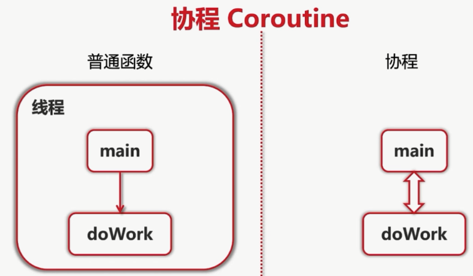

# Go的协程

Go的协程可以看做是一个轻量级的线程，创建一个Go协程的成本很小。

## go协程对比线程的优点

- 与线程相比，Go协程的开销非常小。Go协程的堆栈大小只有几kb，它可以根据应用程序的需要而增长和缩小，而线程必须指定堆栈的大小，并且堆栈的大小是固定的。
- Go协程被多路复用到较少的OS线程。在一个程序中数千个Go协程可能只运行在一个线程中。如果该线程中的任何一个Go协程阻塞（比如等待用户输入），那么Go会创建一个新的OS线程并将其余的Go协程移动到这个新的OS线程。所有这些操作都是 runtime 来完成的，而我们程序员不必关心这些复杂的细节，只需要利用 Go 提供的简洁的 API 来处理并发就可以了。
- Go 协程之间通过信道（channel）进行通信。信道可以防止多个协程访问共享内存时发生竟险（race condition）。信道可以想象成多个协程之间通信的管道。




go的协程：


## 实现一个简单的Go协程

实现Go的协程只需要在调用函数或方法时，前面加上关键字`go`，就可以让go并发的运行。

```go
package main

import (
	"fmt"
	"time"
)

func test() {
	fmt.Println("我是test函数")
}
func main() {
	fmt.Println("我是main函数")
	go test()
	time.Sleep(time.Second * 1)
}

/*
输出结果：
我是main函数
我是test函数
*/
```

在Go的主协程中使用休眠`time.Sleep`，等待其他协程执行完毕。

## 启动多个Go协程

```go
package main

import (
	"fmt"
	"time"
)

func numbers() {
	for i := 1; i < 6; i++ {
		time.Sleep(time.Microsecond * 500)
		fmt.Printf("%d ", i)
	}
}
func test() {
	for i := 'a'; i < 'f'; i++ {
		time.Sleep(time.Microsecond * 600)
		fmt.Printf("%c ", i)
	}
}
func main() {
	go numbers()
	go test()
	time.Sleep(time.Second * 3)
	fmt.Println("main函数")
}
// 输出结果：1 a 2 b 3 c 4 d 5 e main函数
```

